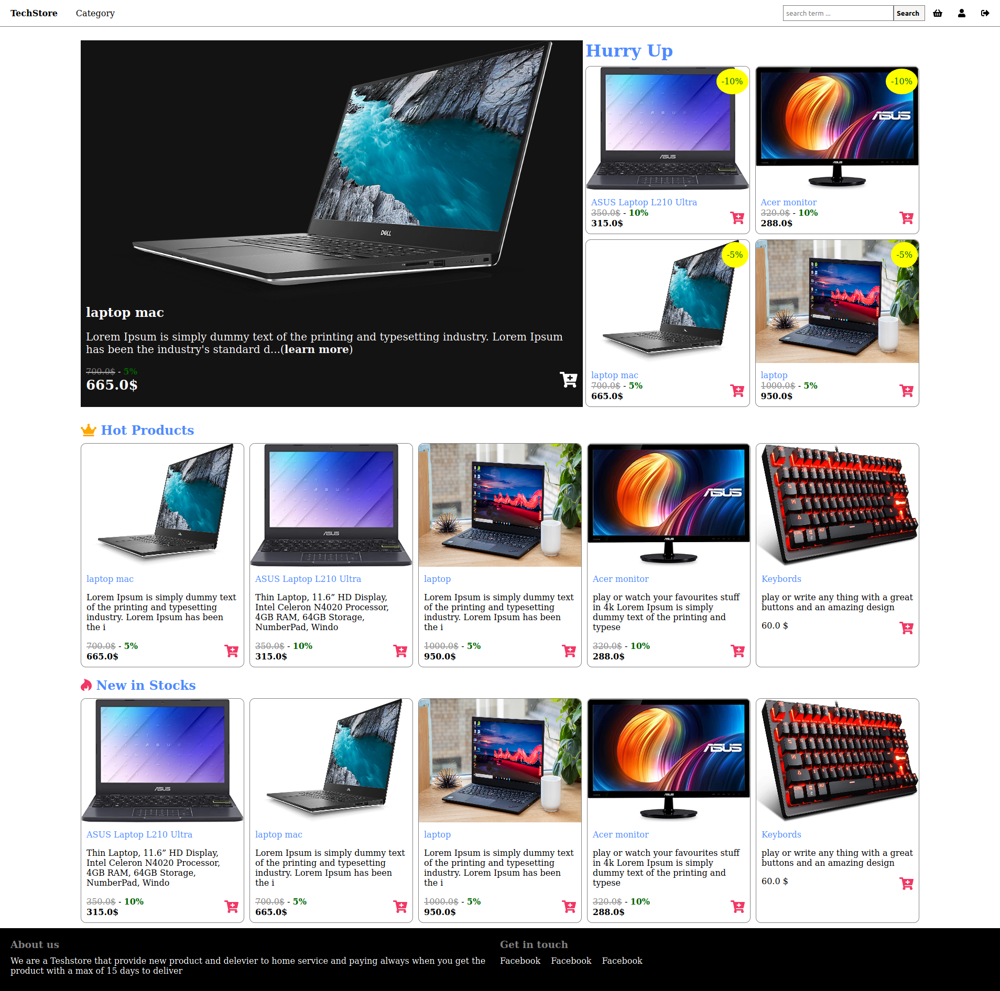
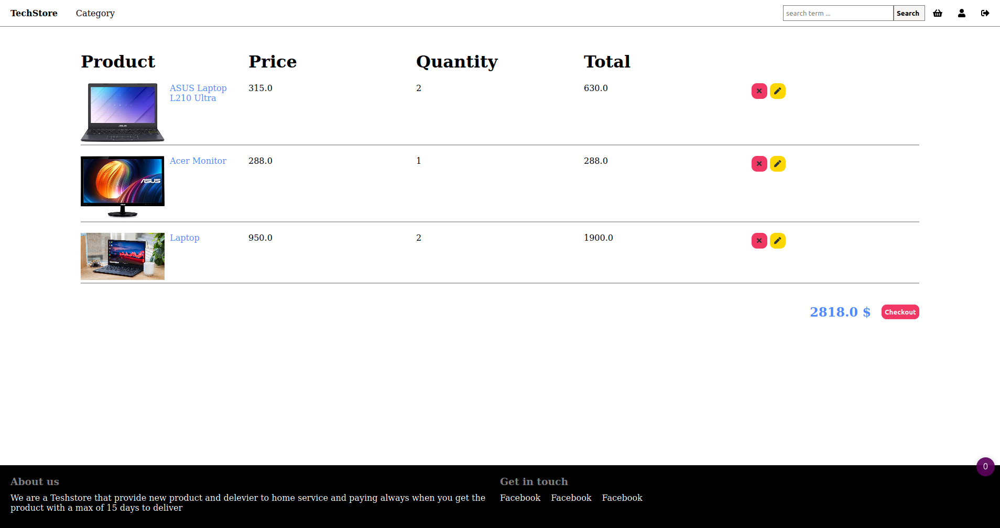
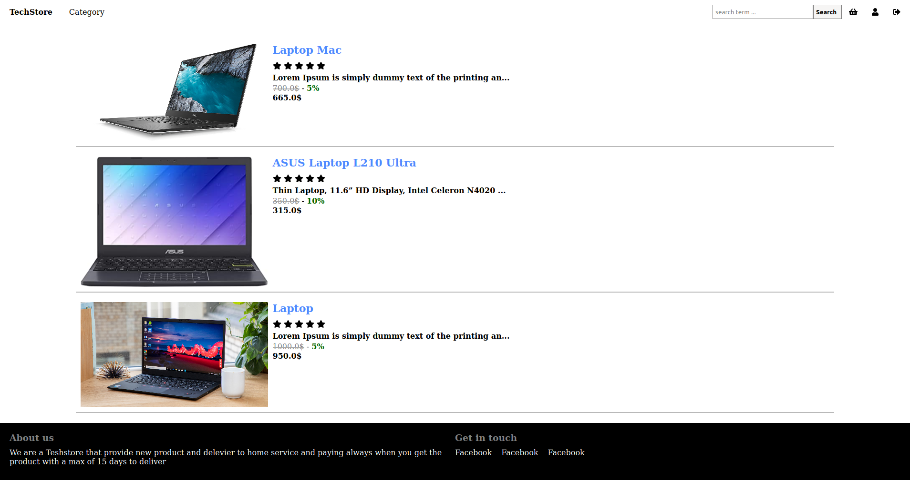
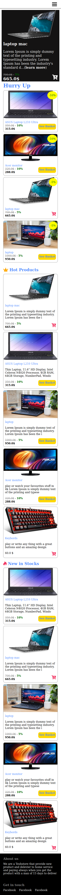

# TechStore

> This repo includes a TechStore where user can explore deferent product based on category or he can search for product name, he can also sign up sign in.

## Project features

#### User Can

- Create an account
- Exolore Products
- Seach For Product
- Add Product to Card
- Edit/Delete Product in the Card
- Checkout from card
- Comment on product
- Rate Product
- See his history of comment
- sign up as a seller

#### Seller Can :

- Create/edit/delete Product
- See Orders
- See his history of orders
- See his Product statics

## Built With

- Ruby v2.7.1
- Ruby on Rails v6.0.3
- JavaScript
- Html5
- Sass
- Rspec
- CapyBara
- Shoulda Matchers

## Live vesion

[click here](https://ancient-journey-67088.herokuapp.com)

## Screenshot









## Getting Started

To get a local copy up and running follow these simple example steps.

### Prerequisites

Ruby: 2.7.1

Rails: v6.0.3

[Chromdriver](https://github.com/SeleniumHQ/selenium/wiki/ChromeDriver)

### Clone the Project

```
$ git clone https://github.com/rida-elbahtouri/Techstore.git

$ cd Techstore
```

### Setup

Instal gems with:

```
bundle install
```

Setup database with:

```
   rails db:migrate
```

### Usage

Start server with:

```
    rails server
```

Open `http://localhost:3000/` in your browser.

# Testing

To run the testing, you need to have ChromeDriver installed in your environment.
Run one of this commands respected to your system:

```
Mac users with Homebrew installed: brew tap homebrew/cask && brew cask install chromedriver
Debian based Linux distros: sudo apt-get install chromium-chromedriver
Windows users with Chocolatey installed: choco install chromedriver

```

Now you can run the testing using this command:

```
rspec

```

## PS

if you still have a problem with webdriver try add gem 'webdrivers' to The Gemfile then run bundle install again

## Developer

👤 **Rida Elbahtouri**

- [Github](https://github.com/rida-elbahtouri)
- [Twitter](https://twitter.com/RElbahtouri)
- [Linkedin](https://www.linkedin.com/in/rida-elbahtouri/)

## 🤝 Contributing

Contributions, issues and feature requests are welcome!

Feel free to check the <a href="https://github.com/rida-elbahtouri/Techstore/issues" target="_blank">issues page</a>.

## Show your support

Give a ⭐️ if you like this project!

## Acknowledgments

- <a href="https://guides.rubyonrails.org/" target="_blank">Rails Guides</a>
